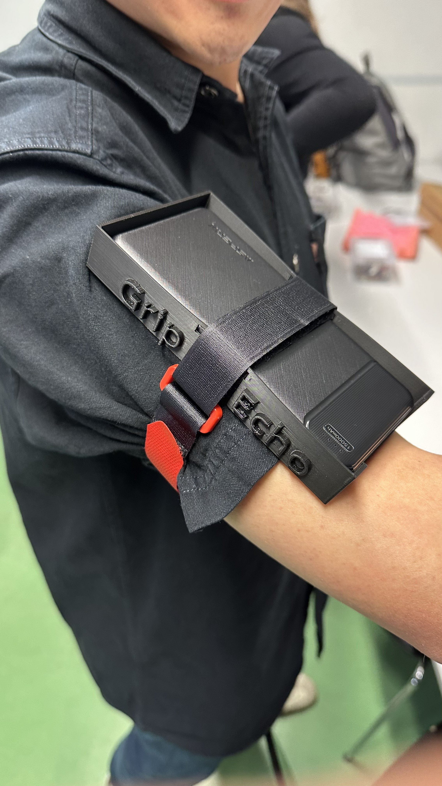
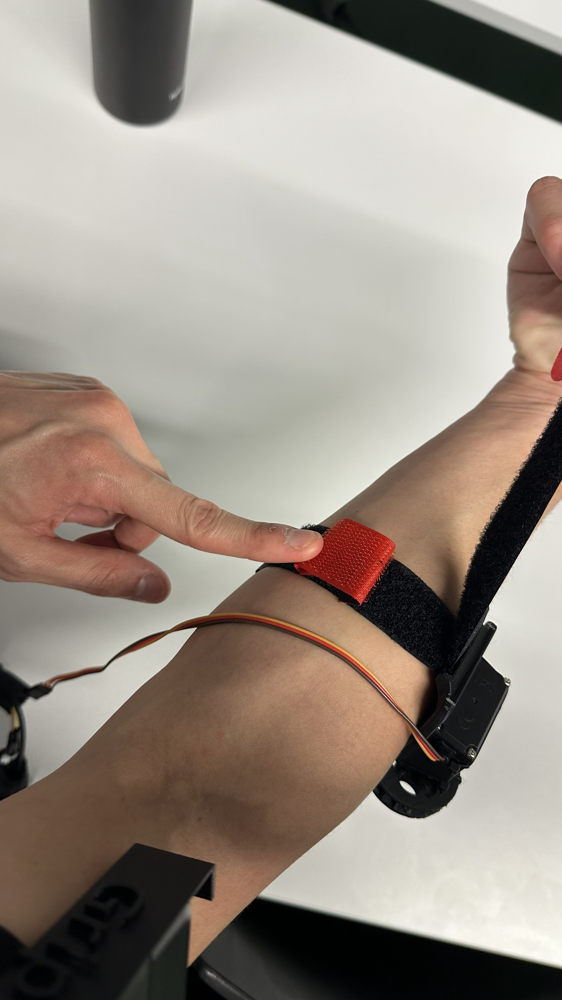
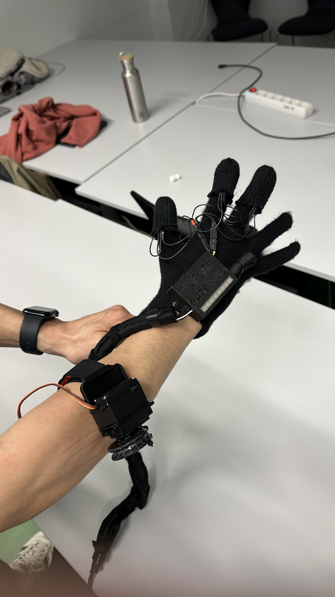
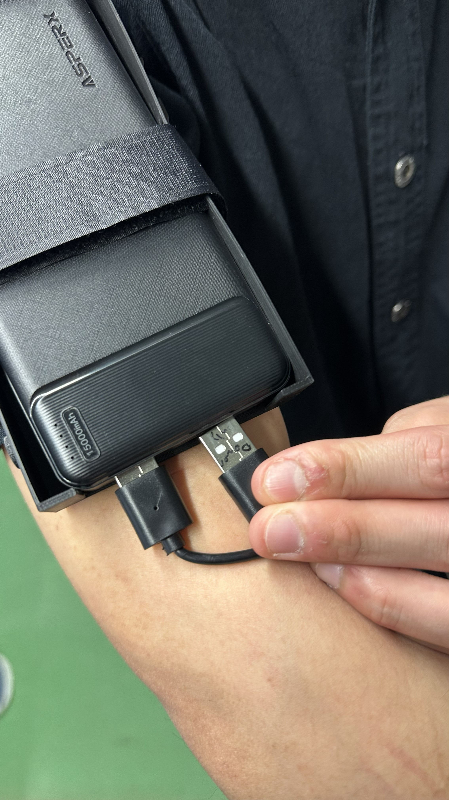
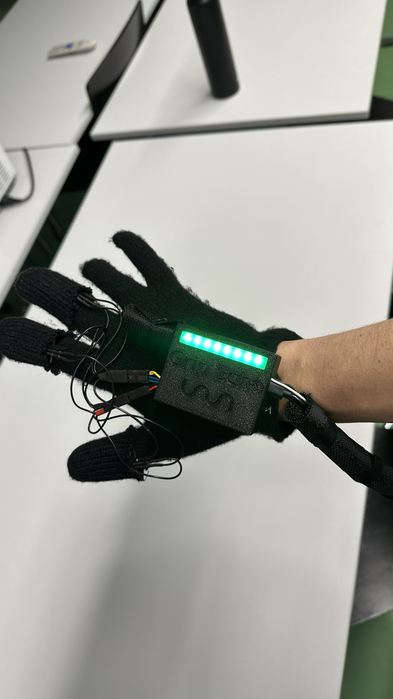
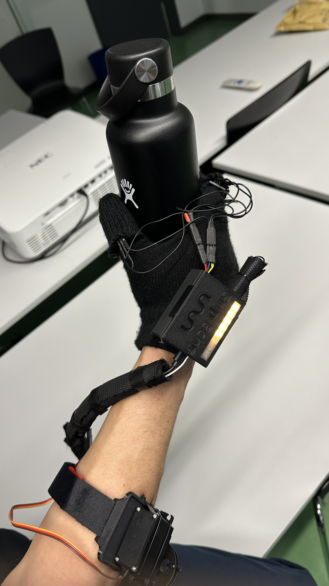

# Grip Echo — Prototype Setup Guide

> ⚠️ **Prototype Notice:** This is an early-stage prototype. Handle all components with care and follow the steps in order.

---

## Setup Instructions

### Step 1 — Attach the Powerbank to Your Upper Arm

Place the powerbank into the Grip Echo custom case and mount it on your **upper arm**. Secure it firmly using the velcro straps, ensuring it sits snugly and does not shift when you move.

---

### Step 2 — Attach the Spool Unit to Your Forearm

Position the spool unit on your **forearm**, making sure the spool faces **outward**, away from your skin. Secure it using the velcro strap. Note that one strap has been intentionally shortened to allow for more flexible fit adjustment — use it to find a comfortable but firm position.

---

### Step 3 — Put On the Glove

Slide on the sensor glove. Make sure:
- The **fingertip sensors are properly aligned** with the tips of each finger
- The glove fits **snugly** without restricting circulation

Take a moment to adjust before proceeding.

---

### Step 4 — Connect the USB Cables

**Order matters here:**

1. First, plug in the **unlabeled** USB cable
2. Then, plug in the **labeled** USB cable

---

### Step 5 — Wait for Calibration

Once connected, Grip Echo will automatically calibrate for **5 seconds**. Do not move your hand during this phase.

Calibration is complete when:
- The **LEDs blink 3 times** ✅
- The **vibration motor pulses briefly** ✅

---

## ✅ Grip Echo is Ready to Use

You're all set. The system is now active and responsive.

---

## Troubleshooting

| Issue | Suggested Fix |
|---|---|
| LEDs don't blink after 5 seconds | Check that both USB cables are fully seated; try re-plugging in order |
| No vibration feedback | Ensure the labeled cable was connected second |
| Sensors feel unresponsive | Re-seat the glove and repeat from Step 4 |
| Strap slips during use | Re-tighten the velcro before powering on |

---

*Grip Echo Prototype — Internal Use Only*